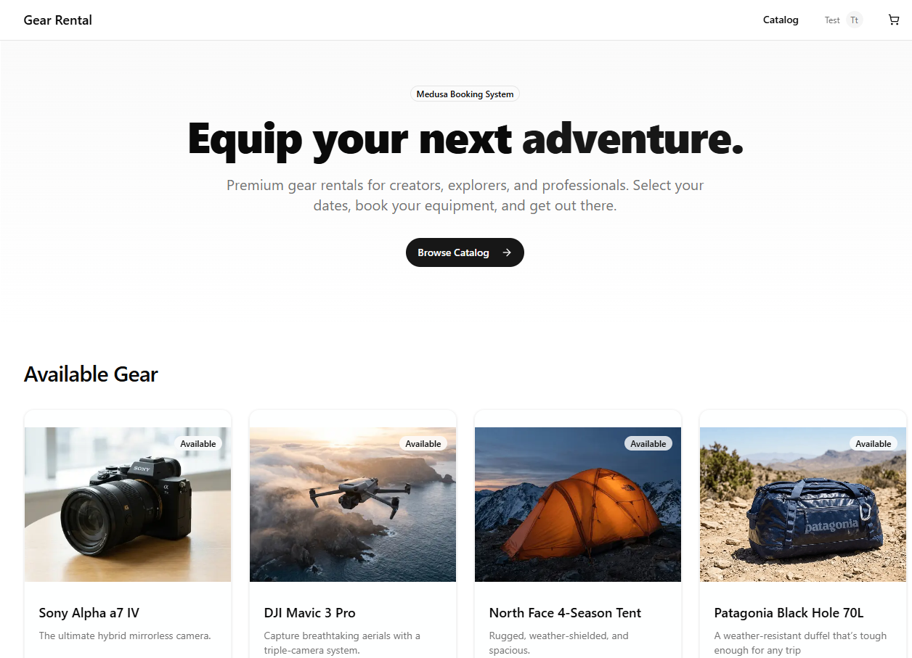

# Medusa Gear Rental Starter



A Next.js storefront for gear and equipment rentals, built on top of a Medusa backend that uses the **Medusa Booking System Plugin**.

This README provides **quick installation and setup instructions** so you can have both the Medusa backend (with booking) and this starter running locally.

> These steps assume a fresh environment. Adapt paths and names as needed for your setup.

---

## 1. Prerequisites

Before installing the starter, make sure you have:

- **Node.js v20+ (LTS)** – recommended by the Medusa docs.  
- **Git**  
- **PostgreSQL** installed and running  
- **Package manager** – `pnpm`, `yarn`, or `npm`

You should also be familiar with the official Medusa installation flow:  
<https://docs.medusajs.com/learn/installation>

---

## 2. Install a Medusa application

Follow the Medusa docs to create a new Medusa project (backend + admin).

From the directory where you keep your projects, run **one** of the following:

### Using `yarn`

```bash
yarn dlx create-medusa-app@latest my-medusa-store
# or
npx create-medusa-app@latest my-medusa-store --use-yarn
```

### Using `pnpm`

```bash
pnpm dlx create-medusa-app@latest my-medusa-store
# or
npx create-medusa-app@latest my-medusa-store --use-pnpm
```

### Using `npm`

```bash
npx create-medusa-app@latest my-medusa-store
```

Replace `my-medusa-store` with your desired project name.  
When prompted, you can skip installing the Medusa Next.js starter storefront (this gear rental starter will be your storefront).

After installation, your Medusa app will live in a folder like:

```bash
/home/you/projects/my-medusa-store
```

---

## 3. Add the Medusa Booking System plugin to the backend

From now on, run commands inside your Medusa project directory, e.g.:

```bash
cd /home/you/projects/my-medusa-store
```

### 3.1. Install the plugin package

```bash
npm install @rsc-labs/medusa-booking-system
# or
yarn add @rsc-labs/medusa-booking-system
# or
pnpm add @rsc-labs/medusa-booking-system
```

### 3.2. Register the plugin in `medusa-config.ts`

Open `medusa-config.ts` in your Medusa backend and add the plugin to the `plugins` array:

```ts
import { defineConfig } from "@medusajs/framework";

export default defineConfig({
  // ... your existing config
  plugins: [
    // ... your existing plugins/modules
    {
      resolve: "@rsc-labs/medusa-booking-system",
      options: {},
    },
  ],
});
```

### 3.3. Generate and run database migrations

Generate migrations for the booking module:

```bash
npx medusa db:generate bookingModule
```

Then apply the migrations:

```bash
npx medusa db:migrate
```

---

## 4. Configure CORS and publishable key

The starter expects the Medusa backend to be available at:

- `http://localhost:9000`

If you change the URL or port, you must update both:

1. Medusa backend `medusa-config.ts` HTTP/CORS configuration (see Medusa docs).  
2. The storefront environment variables (see section **6. Configure the Gear Rental Starter**).

You also need a **publishable API key** on the Medusa backend:

1. Start the Medusa backend (see next section).  
2. Open the Medusa Admin at `http://localhost:9000/app`.  
3. Log in and create a **Publishable API Key** assigned to the sales channel used by this storefront.  
4. Copy the key value (starts with `pk_...`).

You will use this value as `NEXT_PUBLIC_MEDUSA_PUBLISHABLE_KEY` in the storefront `.env`.

---

## 5. Run the Medusa backend (with booking)

From your Medusa backend directory (e.g. `my-medusa-store`):

```bash
npm run dev
# or
yarn dev
# or
pnpm dev
```

By default this starts:

- Medusa server at `http://localhost:9000`  
- Medusa admin at `http://localhost:9000/app`

Leave this process running while you use the gear rental starter.

---

## 6. Install and configure the Gear Rental Starter

Now set up this Next.js project as the storefront that talks to your Medusa backend.

### 6.1. Clone the repository

From the directory where you keep your projects:

```bash
git clone https://github.com/RSC-Labs/medusa-gear-rental-starter medusa-gear-rental-starter
cd medusa-gear-rental-starter
```

### 6.2. Install dependencies

```bash
pnpm install
# or
yarn install
# or
npm install
```

### 6.3. Configure environment variables

This project includes a `.env.example` file. Use it as a base:

```bash
cp .env.example .env
```

Then open `.env` and ensure the values match your Medusa backend:

```bash
MEDUSA_BACKEND_URL=http://localhost:9000
NEXT_PUBLIC_MEDUSA_PUBLISHABLE_KEY=pk_your_publishable_key_here
```

- `MEDUSA_BACKEND_URL` must point to your running Medusa server.  
- `NEXT_PUBLIC_MEDUSA_PUBLISHABLE_KEY` must be a valid publishable key from the Medusa admin.

> Note: `next.config.ts` is already configured to load images from `http://localhost:9000`. If your backend runs elsewhere, update `next.config.ts` and `.env` accordingly.

---

## 7. Run the Gear Rental Starter

With the `.env` configured and dependencies installed, start the Next.js dev server:

```bash
npm run dev
# or
yarn dev
# or
pnpm dev
```

By default this runs at:

- Storefront: `http://localhost:3000`

Make sure your Medusa backend (with the booking plugin) is also running at the same time on `http://localhost:9000`.

If the starter cannot reach Medusa, you’ll see errors like:

> "Unable to load catalog. Please check that the Medusa backend is running."

In that case, verify:

- The Medusa dev server is running on `http://localhost:9000`.  
- CORS settings in `medusa-config.ts` allow requests from `http://localhost:3000`.  
- `MEDUSA_BACKEND_URL` and `NEXT_PUBLIC_MEDUSA_PUBLISHABLE_KEY` in `.env` are correct.

---

## 8. Summary of the full flow

1. **Install Medusa** using `create-medusa-app` as per the docs.  
2. **Add the Booking System plugin** to the Medusa backend: install the package, register it in `medusa-config.ts`, generate and run DB migrations.  
3. **Start the Medusa backend** on `http://localhost:9000`.  
4. **Create a Publishable API Key** in the Medusa admin.  
5. **Clone this Gear Rental Starter**, install dependencies, and set up `.env` with the backend URL and publishable key.  
6. **Run the Next.js dev server** on `http://localhost:3000`.  
7. Open `http://localhost:3000` and start testing the gear rental experience backed by your Medusa booking system.

For more details on Medusa installation and configuration, see the official docs:  
<https://docs.medusajs.com/learn/installation>
